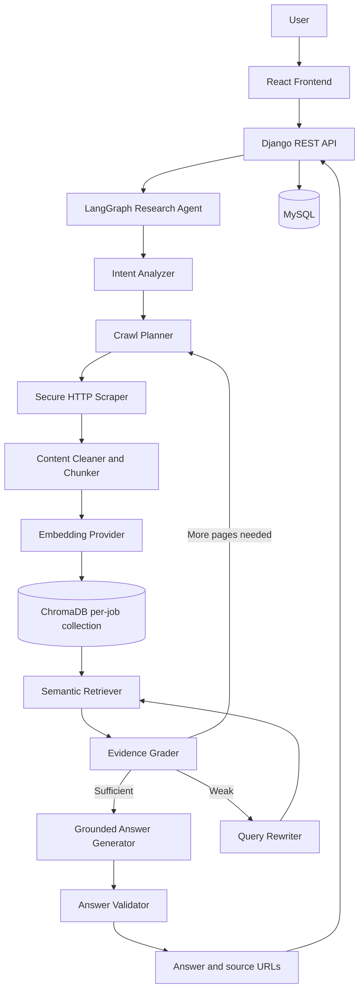
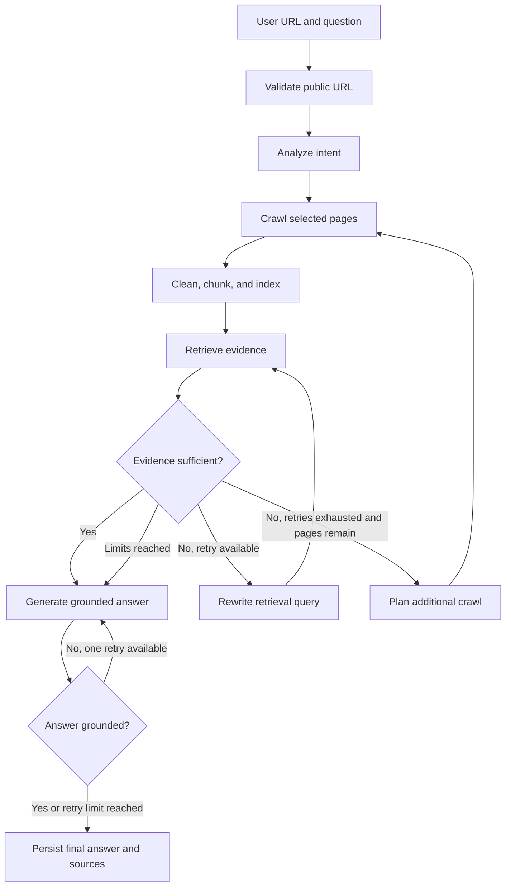

# AI Website Research Agent

An end-to-end, no-authentication research application that accepts a public website URL and a natural-language question, then returns a grounded answer with the pages used as evidence. The backend uses Django REST Framework, a bounded LangGraph agent, prompt-aware HTTP crawling, ChromaDB retrieval, and pluggable language-model and embedding providers. The frontend is a focused React/Vite research workspace.

## Problem statement

Finding a precise answer on an unfamiliar company website often means guessing navigation paths, reading repetitive pages, and manually checking whether a claim is actually supported. A one-shot `scrape → summarize` pipeline makes this worse: it either overloads the model with an entire site or summarizes whichever page happened to be fetched.

This project uses Agentic RAG because research is iterative. The agent forms a structured intent, visits a bounded set of useful pages, indexes clean chunks, judges whether retrieval is sufficient, improves weak searches, optionally investigates more internal pages, and validates the final answer against the evidence.

## Major features

- URL and prompt submission without accounts, login, JWTs, or profiles
- UUID-based persisted research jobs and developer inspection through Django Admin
- Typed LangGraph state with explicit, testable nodes and conditional routes
- Prompt-aware internal-link ranking plus LLM-assisted selection from a deterministic shortlist
- Bounded HTTP scraping with robots.txt support, same-site enforcement, content-type and response-size checks
- Strong SSRF controls for the initial URL and every redirect destination
- HTML cleaning, content hashing, duplicate suppression, configurable chunking, and metadata preservation
- Per-job Chroma collections for hard vector isolation
- Semantic relevance grading, bounded query rewrites, bounded extra crawl passes, and one bounded answer regeneration
- Source-linked, Markdown-formatted responses rendered through sanitization in React
- Centralized environment configuration and provider factories for OpenAI, Gemini, and Anthropic chat models; OpenAI and Gemini embeddings
- Structured logging and a mocked test suite that requires no paid AI calls

## Technology stack

| Layer | Technology |
| --- | --- |
| API and application state | Python, Django 5, Django REST Framework, MySQL |
| Agent orchestration | LangGraph, LangChain Core |
| Retrieval | ChromaDB, LangChain Chroma, configurable embeddings |
| AI providers | OpenAI, Google Gemini, Anthropic (chat); OpenAI, Gemini (embeddings) |
| Extraction | HTTPX, BeautifulSoup 4, `urllib.robotparser` |
| Frontend | React 19, Vite 6, React Markdown, rehype-sanitize |
| Testing | Django test runner, `unittest.mock`, Vite production build, ESLint |

## System architecture



MySQL is the source of truth for operational records. ChromaDB is a replaceable retrieval subsystem. HTTP extraction is behind a scraper service so a future JavaScript renderer can implement the same structured result contract without changing graph nodes.

## Agentic RAG workflow



The graph compiles with a recursion limit as a final safety belt, but normal termination is controlled by explicit counters:

- `AGENT_MAX_RETRIEVAL_RETRIES` applies after each crawl pass.
- `AGENT_MAX_CRAWL_ITERATIONS` controls additional crawl passes after the initial root-page pass.
- Answer validation permits at most one stricter regeneration.
- `CRAWLER_MAX_PAGES` and `CRAWLER_MAX_DEPTH` cap the entire website traversal.

When limits are reached, the graph still produces the best supported answer and instructs the model to say when the requested information was not found.

## LangGraph nodes and routing

| Node | Responsibility |
| --- | --- |
| `validate_url` | Normalize, resolve DNS, and reject non-public destinations |
| `analyze_request` | Produce structured intent, topics, keywords, page types, and search queries |
| `plan_crawl` | Start at the root or choose a small LLM-assisted set from ranked internal links |
| `scrape_pages` | Apply robots, domain, depth, page-count, redirect, timeout, and size rules |
| `process_documents` | Clean HTML, hash/deduplicate content, create metadata-rich chunks, persist page metadata |
| `index_documents` | Embed and add only current-job chunks to its Chroma collection |
| `retrieve_documents` | Run top-k semantic retrieval against that job collection |
| `grade_documents` | Semantically judge coverage and sufficiency against the original question |
| `rewrite_query` | Improve retrieval while preserving original intent |
| `decide_more_crawling` | Check unvisited candidates, page capacity, and additional-crawl limits |
| `generate_answer` | Generate only from labeled retrieved evidence |
| `validate_answer` | Check coverage, grounding, unsupported claims, and source-label validity |
| `finalize` | Mark the graph stage complete; the runner persists the result |

Conditional routing lives in `research/agent/routing/conditions.py`, separate from node implementation, so loop boundaries are directly unit-testable.

## RAG and document processing architecture

Successful HTML pages are parsed with BeautifulSoup. Scripts, styles, navigation, footers, forms, cookie banners, hidden elements, and common modal/newsletter containers are removed. Headings, paragraphs, lists, and table text are retained and normalized. Pages with fewer than 25 useful words are not indexed. SHA-256 content hashes suppress identical pages within a processing batch.

`RecursiveCharacterTextSplitter` creates configurable overlapping chunks. Every chunk carries:

```json
{
  "job_id": "7a537...",
  "source_url": "https://example.com/products",
  "page_title": "Products",
  "chunk_index": 2,
  "content_hash": "3f92..."
}
```

Only top-k retrieved chunks are passed to grading and generation; the full scraped site is never sent to the model.

## Prompt template architecture

All long agent instructions live as versioned YAML files in `backend/research/agent/prompts/`:

```text
intent_analysis.yaml       crawl_planning.yaml
relevance_grading.yaml     query_rewriting.yaml
answer_generation.yaml     answer_validation.yaml
```

Each file declares `name`, `version`, `description`, `system_template`, and `user_template`. `loader.py` parses and validates a template; `registry.py` maps stable names to files and caches loaded definitions. `PromptTemplate.render()` validates every required variable and raises a meaningful error before an LLM call.

To change behavior, edit and version the relevant YAML template. To add a prompt, create a file with the five required fields, register its stable name in `REGISTERED_PROMPTS`, then call `get_prompt("new_name").render(...)` in a node. The graph does not contain embedded long prompts, so prompt iteration is decoupled from routing code.

## Provider architecture

The graph knows only LangChain-compatible interfaces. `get_llm()` and `get_embedding_model()` are the sole provider construction points.

- `LLM_PROVIDER=openai`, `gemini`, or `anthropic`
- `EMBEDDING_PROVIDER=openai` or `gemini`
- model names are supplied separately through `LLM_MODEL` and `EMBEDDING_MODEL`
- only the selected provider's key is required; unselected provider keys may remain empty
- a missing selected key or unsupported provider raises a clear `configuration_error`

Adding a provider means extending one factory, not modifying the graph or retrieval services.

## Web crawling architecture

The first crawl visits only the validated root. Extracted links are canonicalized, deduplicated, restricted to the root hostname (with `www` treated as an alias), and scored using intent terms, anchor text, path terms, depth, query strings, and low-value page penalties. If evidence remains weak after retrieval retries, an LLM chooses up to three URLs from the highest deterministic candidates. Invalid LLM choices are discarded and the deterministic order is a safe fallback.

The crawler sends the configured User-Agent, reads robots.txt where available, waits between content requests, and never bypasses authentication, CAPTCHAs, paywalls, or anti-bot controls. It accepts HTML, XHTML, and text only. Playwright is intentionally not required for this MVP.

## MySQL and ChromaDB responsibilities

MySQL stores:

- research UUIDs, URLs, prompts, status, and current stage
- final answers, source lists, safe error summaries, and timestamps
- page URL/title, a fixed-length URL hash for MySQL-safe uniqueness, response status, scrape outcome, content hash, word count, and depth
- page, retrieval, and crawl counters

ChromaDB stores:

- cleaned chunks and their vector embeddings
- source URL, title, chunk position, job ID, and content hash metadata
- vector indexes used for semantic similarity retrieval

Embeddings are not stored in MySQL because they require a vector-native index and similarity search operations that are separate from transactional job state. The MVP creates one Chroma collection per research UUID. This gives hard job isolation without relying solely on caller-supplied filters. `JobVectorStore.delete_job()` is the lifecycle cleanup boundary for a future retention task; search also checks `job_id` metadata defensively.

## Project structure

```text
.
├── .env.example
├── backend/
│   ├── config/                  # Django settings, URLs, WSGI/ASGI
│   ├── research/
│   │   ├── agent/
│   │   │   ├── nodes/           # Crawl, RAG, answer, and shared context
│   │   │   ├── prompts/         # YAML prompts, loader, and registry
│   │   │   ├── providers/       # LLM and embedding factories
│   │   │   ├── routing/         # Conditional loop decisions
│   │   │   ├── graph.py
│   │   │   └── state.py
│   │   ├── migrations/
│   │   ├── services/            # URL, crawler, scraper, processing, vectors, runner
│   │   ├── tests/
│   │   ├── models.py
│   │   ├── serializers.py
│   │   └── views.py
│   ├── manage.py
│   └── requirements.txt
└── frontend/
    ├── src/api/researchApi.js
    ├── src/components/
    ├── src/App.jsx
    ├── src/styles.css
    └── package.json
```

## Environment setup

### 1. Configure environment variables

Copy `.env.example` to `.env` at the repository root and set a real Django secret, MySQL credentials, and keys for only the selected providers. A local `.env` with non-secret placeholders is already ignored by Git.

| Variable | Purpose |
| --- | --- |
| `DJANGO_SECRET_KEY`, `DEBUG`, `ALLOWED_HOSTS` | Django runtime |
| `DB_NAME`, `DB_USER`, `DB_PASSWORD`, `DB_HOST`, `DB_PORT` | MySQL connection |
| `LLM_PROVIDER`, `LLM_MODEL` | Chat model selection |
| `OPENAI_API_KEY`, `GEMINI_API_KEY`, `ANTHROPIC_API_KEY` | Provider secrets; only selected providers are required |
| `EMBEDDING_PROVIDER`, `EMBEDDING_MODEL` | Embedding selection |
| `CHROMA_PERSIST_DIRECTORY` | Persistent vector database location |
| `FRONTEND_ORIGIN` | Exact allowed CORS/CSRF frontend origin |
| `CRAWLER_USER_AGENT` | Responsible crawler identity |
| `CRAWLER_TIMEOUT_SECONDS` | Per-request HTTP timeout |
| `CRAWLER_MAX_PAGES`, `CRAWLER_MAX_DEPTH` | Global crawl bounds |
| `CRAWLER_MAX_PAGE_BYTES`, `CRAWLER_MAX_REDIRECTS` | Response and redirect bounds |
| `CRAWLER_REQUEST_DELAY_SECONDS` | Delay between content requests |
| `AGENT_MAX_RETRIEVAL_RETRIES`, `AGENT_MAX_CRAWL_ITERATIONS` | Agent loop bounds |
| `RETRIEVAL_TOP_K`, `RELEVANCE_SCORE_THRESHOLD` | Retrieval and grading behavior |
| `DOCUMENT_CHUNK_SIZE`, `DOCUMENT_CHUNK_OVERLAP` | Chunking behavior |
| `MAX_PROMPT_LENGTH` | Authoritative backend input limit |

### 2. Create MySQL database

Run equivalent statements using an administrator account and replace the example password:

```sql
CREATE DATABASE website_research CHARACTER SET utf8mb4 COLLATE utf8mb4_unicode_ci;
CREATE USER 'research_user'@'localhost' IDENTIFIED BY 'replace-with-a-strong-password';
GRANT ALL PRIVILEGES ON website_research.* TO 'research_user'@'localhost';
FLUSH PRIVILEGES;
```

Set the matching values in `.env`.

### 3. Install and run the backend

Python 3.11+ is recommended. The configured MySQL Connector/Python backend does not require platform-specific MySQL client headers.

```bash
cd backend
python -m venv .venv
# Windows PowerShell: .venv\Scripts\Activate.ps1
# macOS/Linux: source .venv/bin/activate
pip install -r requirements.txt
python manage.py migrate
python manage.py createsuperuser  # optional, for /admin/
python manage.py runserver
```

Chroma creates its persistent directory automatically on first indexing. No separate Chroma server is needed.

### 4. Install and run the frontend

```bash
cd frontend
copy .env.example .env
npm install
npm run dev
```

Open `http://localhost:5173`. The API defaults to `http://localhost:8000/api`.

## REST API

### `POST /api/research/`

Runs one synchronous MVP research job.

```json
{
  "url": "https://example.com",
  "prompt": "Find the company's AI products and summarize their main features."
}
```

Successful response (`201 Created`):

```json
{
  "job_id": "7a537cb6-e870-4a25-adc2-e580340c65be",
  "status": "completed",
  "current_stage": "completed",
  "website_url": "https://example.com",
  "prompt": "Find the company's AI products and summarize their main features.",
  "answer": "## Findings\n... [Source 1]",
  "sources": [{"title": "Products", "url": "https://example.com/products"}],
  "pages_scraped": 3,
  "retrieval_iterations": 4,
  "crawl_iterations": 2,
  "error_message": "",
  "created_at": "2026-09-07T09:30:00Z",
  "started_at": "2026-09-07T09:30:00Z",
  "completed_at": "2026-09-07T09:30:18Z"
}
```

Predictable failures use `{ "error": { "code": "...", "message": "..." } }` and never include stack traces. Common codes are `validation_error`, `invalid_url`, `blocked_url`, `scraping_failed`, `configuration_error`, and `research_failed`.

### `GET /api/research/{job_uuid}/`

Returns the stored status, result, counters, timestamps, and safe error message for a job. This endpoint makes future polling/background execution possible without changing the response model.

## Security considerations

- Only `http://` and `https://` are accepted. Embedded URL credentials and unsupported schemes are rejected.
- Hostnames are resolved before every request. Every resolved address must be globally routable; private, loopback, link-local, multicast, reserved, unspecified, localhost/internal suffixes, and cloud metadata ranges are blocked.
- Redirects are manual and every destination is normalized, DNS-resolved, and revalidated before connection. Environment HTTP proxies are disabled for crawler requests.
- Automatic discovery is restricted to the root hostname; external domains and subdomains are not followed. Common `www` aliases are treated as the same site.
- Page count, depth, timeout, response bytes, redirects, retrieval retries, crawl passes, answer regeneration, and prompt length all have hard configurable limits.
- Only expected text content types are processed. Scraped HTML is never returned to or rendered by React.
- Generated Markdown is sanitized before rendering; external source links use `target="_blank"` with `rel="noopener noreferrer"`.
- Evidence prompts mark scraped text and link labels as untrusted data and tell models to ignore embedded instructions, reducing indirect prompt-injection risk.
- CORS uses the exact `FRONTEND_ORIGIN`; there is no wildcard production configuration.
- Logs record stages and failure types, never secrets or full environment configuration.
- The crawler identifies itself, honors robots.txt where available, uses request spacing, and does not bypass access controls.

DNS can change between validation and socket connection (DNS rebinding). For high-risk public deployments, place outbound crawling in an isolated egress proxy that pins validated IPs and enforces network policy at the infrastructure layer. Also add reverse-proxy request throttling: authentication is intentionally excluded from this MVP, so a public endpoint needs rate limits, quotas, WAF rules, and resource monitoring.

## Testing

Tests use SQLite through `config.settings_test` and mock all paid providers and outbound requests:

```bash
cd backend
python manage.py test --settings=config.settings_test
python manage.py check --settings=config.settings_test
python manage.py makemigrations --check --dry-run --settings=config.settings_test
```

Frontend verification:

```bash
cd frontend
npm run lint
npm run build
```

Coverage includes URL protocols, private networks, mixed DNS answers, redirect revalidation, streaming size bounds, same-site links, normalization/deduplication, crawler page/depth bounds, link ranking, content cleaning, job/API behavior, safe failure persistence, prompt loading and variables, selected-provider key checks, Chroma job isolation, graph compilation, routing, retrieval retry limits, crawl retry limits, and answer-regeneration limits.

## No-authentication design decision

Research jobs belong to UUIDs rather than users. No login, signup, password, JWT, profile, social-authentication, or role-management code is present. UUIDs are identifiers, not access-control secrets. Before storing sensitive research in a public deployment, add an explicit privacy/authentication design rather than assuming unguessable IDs are authorization.

## Known MVP limitations

- Research runs synchronously inside the POST request, so reverse-proxy timeouts may constrain larger jobs.
- HTTP extraction cannot see content that requires client-side JavaScript.
- The crawler starts from document links and does not yet use sitemaps, PDFs, feeds, or search engines.
- Relevance grading and citation validation are model-based, not formal entailment proofs.
- Chroma collections have a deletion method but no scheduled retention policy.
- The API has no application-level throttling because production limits are expected at the gateway for this MVP.
- One website hostname is researched at a time; subdomains and cross-domain evidence are excluded.

## Future improvements

- Celery and Redis background jobs
- Server-Sent Events or WebSockets for real-time progress
- Playwright adapter for JavaScript-heavy sites
- Sitemap-aware crawling and PDF extraction
- Multiple-site and controlled cross-domain research
- Scheduled research, history, and Markdown/PDF exports
- Search-engine integration and result caching
- Hybrid BM25/vector retrieval, advanced reranking, and stronger citation verification
- Automated Chroma retention and lifecycle cleanup
- Production telemetry, tracing, alerts, rate limiting, and egress isolation
- Docker, CI/CD, cloud deployment, and managed MySQL/vector infrastructure

The runner/service boundary and persisted `current_stage` are deliberately designed so background workers and progress streaming can be added without rewriting the LangGraph workflow.
